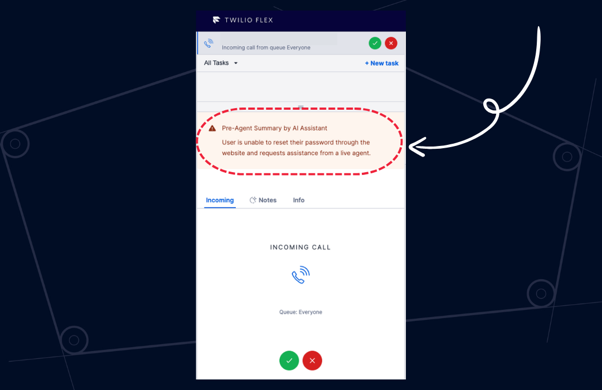
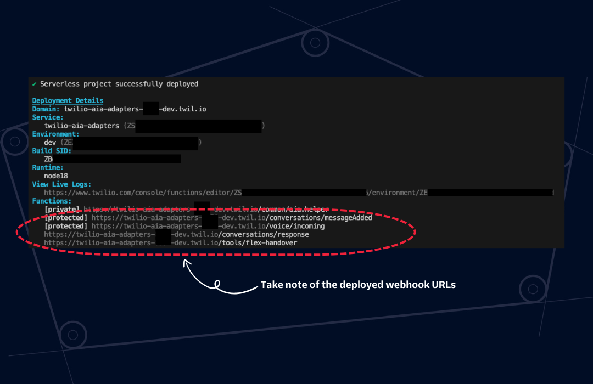
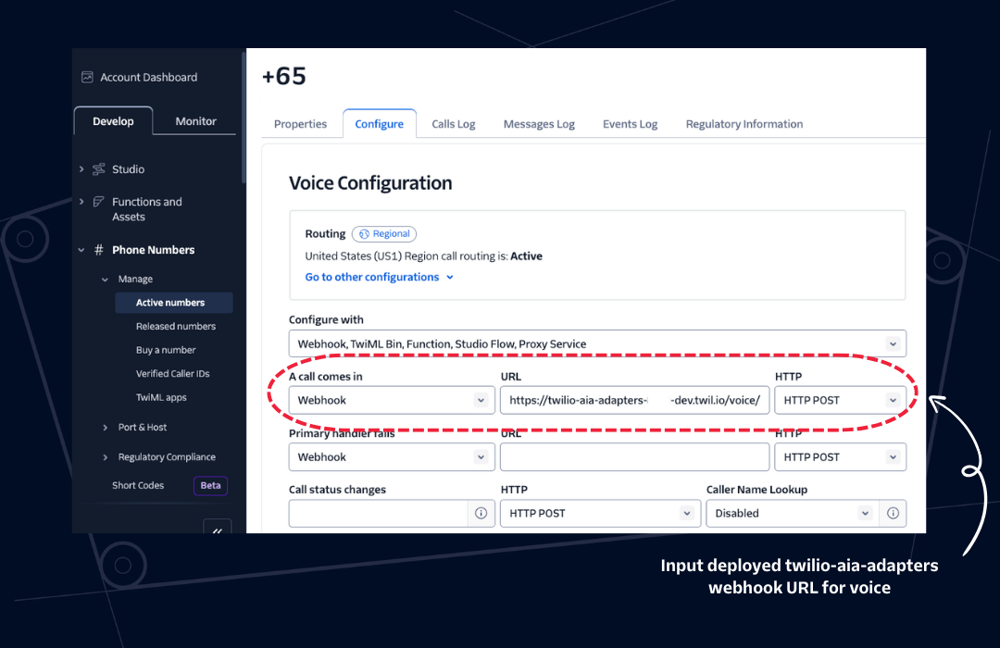
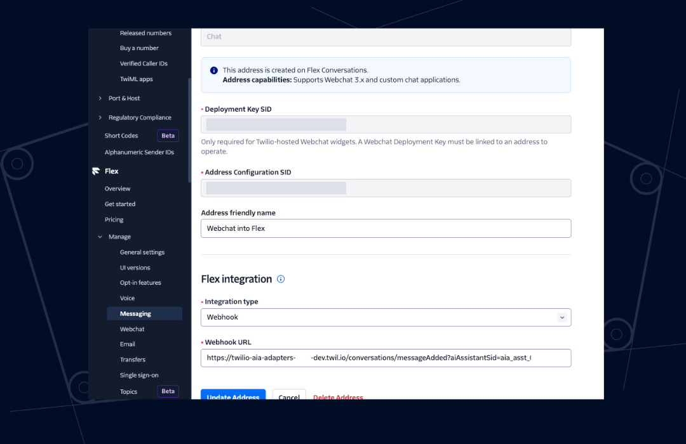
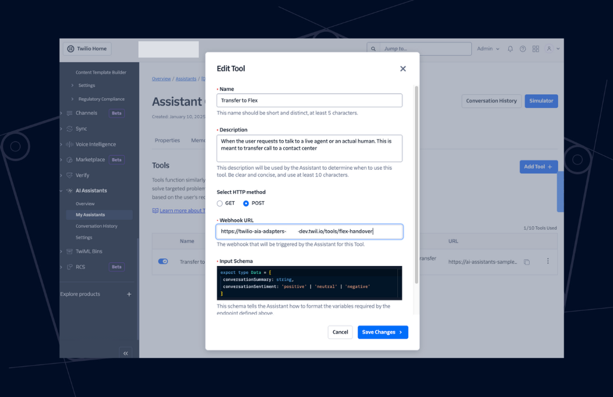

# Twilio AI Assistant (AIA) Adapters

Twilio AI Assistant (AIA) Adapters is an open-source quick-start sample middleware for integrating Twilio AI Assistant with various communication channels. It provides a flexible and extensible way to connect AI-powered conversational experiences to Twilio Voice, SMS, WhatsApp, and Flex Webchat 3.0.

<p align="center">
    
</p>

## Features

- **Quick-Start**: Simplifies AI Assistant deployment with sample ready-to-go configurations
- **Performant**: Optimizes the number of required API calls to ensure low overhead latency
- **Multi-Channel Support**: Integrates AI Assistant with Twilio Voice and Conversations (SMS, WhatsApp, and Flex Webchat 3.x)
- **Extensible Middleware**: Easily customize and extend adapter functionality.
- **Enhanced Twilio Flex Handover**: Ensures that all attributes from Tools input are passed as task attributes within Twilio Flex

## What You Get with `aia-adapters`

### 1. Ready-to-Use Webhook: `/voice/incoming`

| Query Parameter(s) | Required | Default Value | Description                                       |
| ------------------ | -------- | ------------- | ------------------------------------------------- |
| `aiAssistantSid`   | Required | N/A           | Twilio AI Assistant SID (starts with `aia_xxxxx`) |
| `language`         | Optional | "default"     | The language to be used by Twilio AI Assistant    |

Supported languages with preset configurations:

- `default`
- `en-US`
- `en-AU`
- `es-ES`
- `hi-IN`
- `ja-JP`
- `ko-KR`
- `pt-BR`
- `th-TH`
- `vi-VN`
- `zh-CN`
- `zh-HK`

To use a different language, specify the supported language within the `language` parameter.

Example: `https://twilio-aia-adapters-XXXX-dev.twil.io/voice/incoming?aiAssistantSid=aia_xxxxx&language=zh-CN`

Language configurations can be easily added or modified by updating the `assets/voice-languages-config.private.json` file.

> [!IMPORTANT]
> The preset language configurations primarily use ElevenLabs voices, which are currently in private beta. To enable access, you will need to request it through Twilio Support. Alternatively, you can use the [Google's Generative Voices](https://www.twilio.com/docs/voice/twiml/say/text-speech#available-voices-and-languages).

### 2. Ready-to-Use Webhook: `/conversations/messageAdded`

| Query Parameter(s)    | Required | Default Value  | Description                                                                                                                |
| --------------------- | -------- | -------------- | -------------------------------------------------------------------------------------------------------------------------- |
| `aiAssistantSid`      | Required | N/A            | Twilio AI Assistant SID (starts with `aia_xxxxx`)                                                                          |
| `aiAssistantIsTyping` | Optional | `false`        | Injects the attribute `assistantIsTyping` into the conversation attribute. Setting this to true will increase the latency. |
| `aiAssistantIdentity` | Optional | `AI Assistant` | The identity name of Twilio AI Assistant within the conversation                                                           |

### 3. Ready-to-Use Webhook: `/tools/flex-handover`

| Query Parameter(s) | Required | Default Value | Description                                                |
| ------------------ | -------- | ------------- | ---------------------------------------------------------- |
| `workspaceSid`     | Required | N/A           | Twilio TaskRouter's Workspace SID (starts with `WSxxxxxx`) |
| `workflowSid`      | Required | N/A           | Twilio TaskRouter's Workflow SID (starts with `WWxxxxxx`)  |

All attributes provided in the Twilio AI Assistant's Tool - Input Schema will be transferred as task attributes in Twilio Flex.

### 4. Twilio Flex Plugin: AI Assistant Summary

A lightweight Twilio Flex Plugin that showcases the Twilio AI Assistant's summary and sentiment, utilizing the task attributes `conversationSummary` and `conversationSentiment` passed from the AI Assistant's Tool execution during the Twilio Flex handover.

<p align="center">
    
</p>

## Deploying `aia-adapters`

### Prerequisites

1. Twilio Flex Account ([Guide](https://support.twilio.com/hc/en-us/articles/360020442333-Setup-a-Twilio-Flex-Account))
2. Twilio AI Assistant configured ([Guide](https://www.twilio.com/docs/alpha/ai-assistants/quickstart))
3. Node.js v18.x.x only ([Guide](https://docs.npmjs.com/downloading-and-installing-node-js-and-npm))
4. Twilio CLI v5.22.9 or above ([Guide](https://www.twilio.com/docs/twilio-cli/quickstart))
5. Twilio CLI Serverless Toolkit v3.2.0 or above ([Guide](https://www.twilio.com/docs/labs/serverless-toolkit/getting-started))
6. Twilio CLI Flex Plugin v7.1.0 or above ([Guide](https://www.twilio.com/docs/flex/developer/plugins/cli/install))

### Step 1: Deploy Serverless Function

```bash
# Clone project
git clone https://github.com/leroychan/twilio-aia-adapters.git

# Change to working directory
cd twili-aia-adapters/serverless-functions

# Install NPM packages
npm install

# Build project as the source code is built using TypeScript
npm run build

# Verify Twilio account is selected correctly on Twilio CLI
twilio profiles:list

# Deploy to Twilio account
twilio serverless:deploy

# Take note of the webhook URL that is dislayed within the CLI
```

<p align="center">
    
</p>

### Step 2: Configure Integration to Twilio AI Assistant

#### Voice

1. Navigate to **Twilio Console > Phone Numbers > Manage > Active Numbers**
2. Select your **DESIRED VOICE-CAPABLE NUMBER**
3. Go to **Configure > Voice Configuration > A Call Comes In**
4. Set the webhook URL to: `https://twilio-aia-adapters-XXXX-dev.twil.io/voice/incoming?aiAssistantSid=aia_xxxxx` with `HTTP POST`
5. Click `Save configuration`

<p align="center">
    
</p>

#### Conversations (i.e. SMS, WhatsApp)

1. Navigate to **Twilio Console > Conversations > Addresses > Configure addresses**
2. Under your **DESIRED MESSAGING CHANNEL**, click on the Pencil Icon
3. Under `Step 1: Autocreate Conversations for new messages?`, Enable `Autocreate a conversation`
4. Under `Step 2: Which Conversations Service should the Conversation be created in?`, select `Flex Chat Service`
5. Under `Step 3: Want to set up an integration?`, select `Webhook`

- Webhook URL for incoming messages: `https://twilio-aia-adapters-XXXX-dev.twil.io/conversations/messageAdded?aiAssistantSid=aia_xxxxx`
- Webhook method: `POST`
- Webhook Filters: `onMessageAdded` only

6. Click `Update`

<p align="center">
    
</p>

#### Twilio Flex Webchat 3.x

1. Ensure you have Twilio Flex Webchat 3.x configured ([Guide](https://www.twilio.com/docs/flex/developer/conversations/webchat/setup))
2. Navigate to **Twilio Console > Flex > Manage > Messaging**
3. Under **Filter by Address type**, select **Chat**
4. Under your **DESIRED FLEX WEBCHAT ADDRESS**, click on the Pencil Icon
5. Under **Flex Integration**

   - Integration Type: `Webhook`
   - Webhook URL: `https://twilio-aia-adapters-XXXX-dev.twil.io/conversations/messageAdded?aiAssistantSid=aia_xxxxx`

6. Click **Update Address**

<p align="center">
    
</p>

#### Twilio Flex Handover

1. Navigate to **Twilio Console > TaskRouter > Workspaces** to obtain both `workspaceSid` (i.e. `WSxxxxx`) and `workflowSid` (`WWxxxx`). `workflowSid` can be retrieved after clicking into the default workspace named `Flex Task Assignment` and then `Workflows`.
2. Once done, navigate to **Twilio Console > AI Asssitant > My Assistants**
3. Select your **DESIRED AI ASSISTANT**
4. Go to **Tools\* and click **Add Tool\* button
   - Name: `Twilio Flex Handover`
   - Description: `When the user requests to talk to a live agent or an actual human. This is meant to transfer call to a contact center`
   - Select HTTP Method: `POST`
   - Webhook URL: `https://twilio-aia-adapters-XXXX-dev.twil.io/tools/flex-handover?workfspaceSid=WSxxxxx&workflowSid=WWxxxxxx`
   - Input Schema:
     ```javascript
     export type Data = {
       conversationSummary: string,
       conversationSentiment: "positive" | "neutral" | "negative",
     };
     ```
   - Authorization Provider: `None`
5. Click _Save Changes_ button

<p align="center">
    
</p>

### [Optional] Step 3: Deploy Twilio Flex Plugin - AI Assistant Summary

```bash
# Change to working directory
cd ..
cd plugin-aia-summary

# Install Dependencies
npm install

# Optional - Modify Environment Variables. You can also pass it via query parameters.
cp .env.example .env

# Optional - Local Development
twilio flex:plugins:start

# Verify Twilio account is selected correctly on Twilio CLI
twilio profiles:list

# Deploy to Twilio Flex Instance
twilio flex:plugins:deploy --changelog "Deploy AI Assistant Summary Plugin"

twilio flex:plugins:release --plugin plugin-aia-summary@0.0.1 --name "Deploy AIA Plugin" --description "Displays AI Assistant's Conversation Summary and Conversation Sentiment"
```
